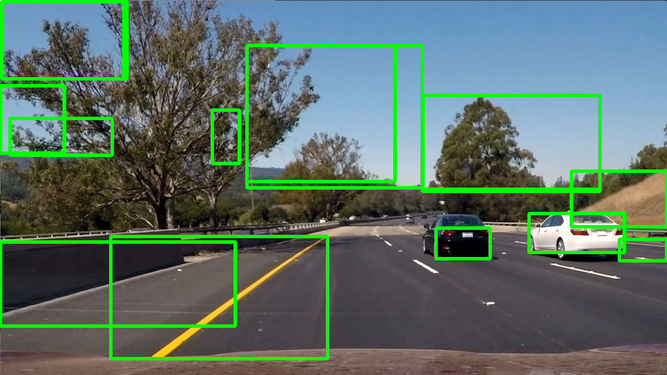
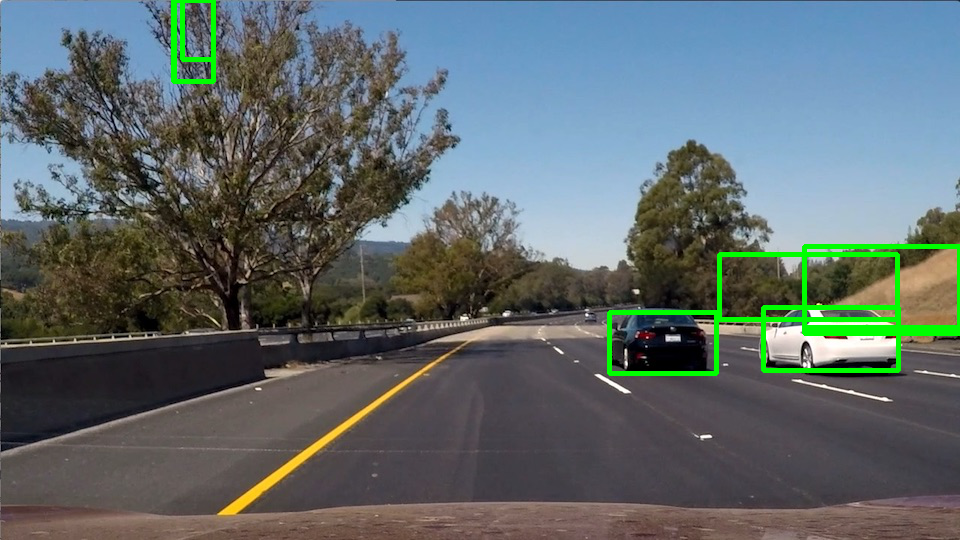

Selective search for object detection implementation based on Efficient Graph-Based Image Segmentation.

The first one is the sequential implementation, it takes about 1.8 second to process one image to generate possible bounding boxes.

The second one is for the parallel implementation, and the idea is to partition the image into 4 parts and then use the Borůvka's type algorithm to find the segmentation the 4 parts and then merge them together. It takes about 0.9 second to generate the bounding boxes.

